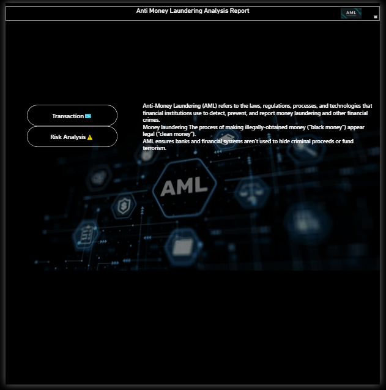
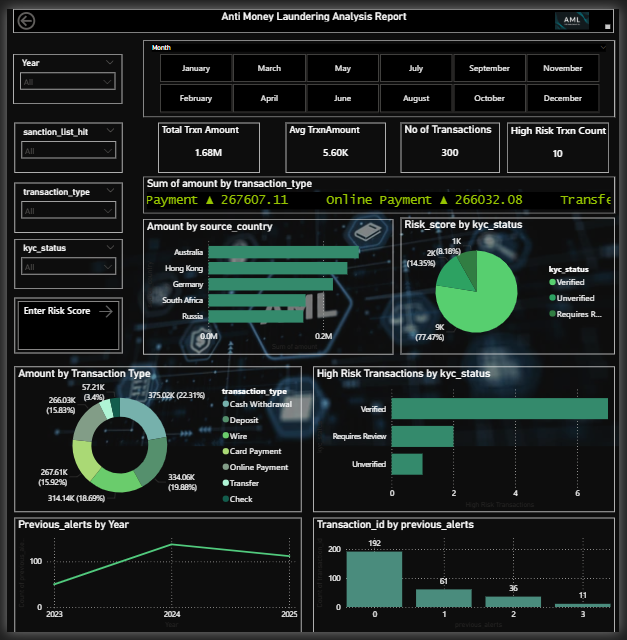
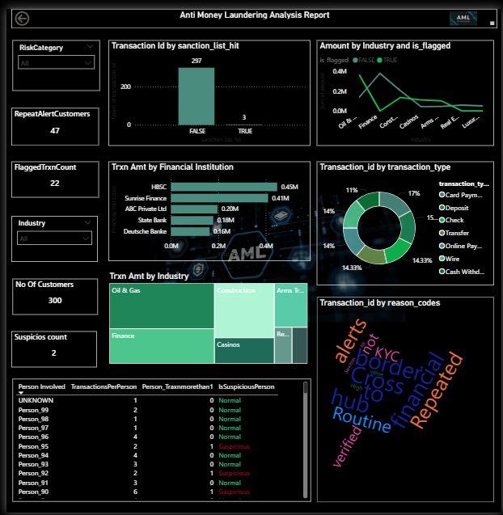

**Anti Money Laundering Dashboard**

This analysis focuses on Anti-Money Laundering (AML) by monitoring customer transactions to identify unusual patterns, high-risk behavior, and potential compliance risks. Transaction data is analyzed to detect anomalies such as abnormal transaction frequency, value spikes, and suspicious counterparties. Risk analysis helps categorize customers and transactions based on exposure levels, supporting proactive investigation, regulatory compliance, and effective fraud prevention.

📄 **Summary Page**

The Summary page provides a high-level overview of the Anti-Money Laundering (AML) analysis and acts as a central navigation hub for the report. It includes interactive buttons that allow users to quickly navigate to the Transaction Analysis and Risk Analysis pages for deeper insights.

**Dashboard Preview**

📄 **Page 1: Transaction Analysis**

The Transaction Analysis page provides a comprehensive view of transactional activity across customers, industries, and financial institutions. It helps users understand how transactions are distributed by type, source, and behavior, enabling quick identification of unusual trends and abnormal transaction patterns. Interactive filters allow focused analysis by industry, transaction type, and customer attributes.

**Dashboard Preview**

📄 **Page 2: Risk Analysis**

The Risk Analysis page focuses on identifying and assessing high-risk transactions and customers. It evaluates risk based on KYC status, sanction list hits, previous alerts, and behavioral indicators. This page supports proactive monitoring by highlighting potential compliance risks and enabling deeper investigation into flagged transactions and suspicious entities.

**Dashboard Preview**

