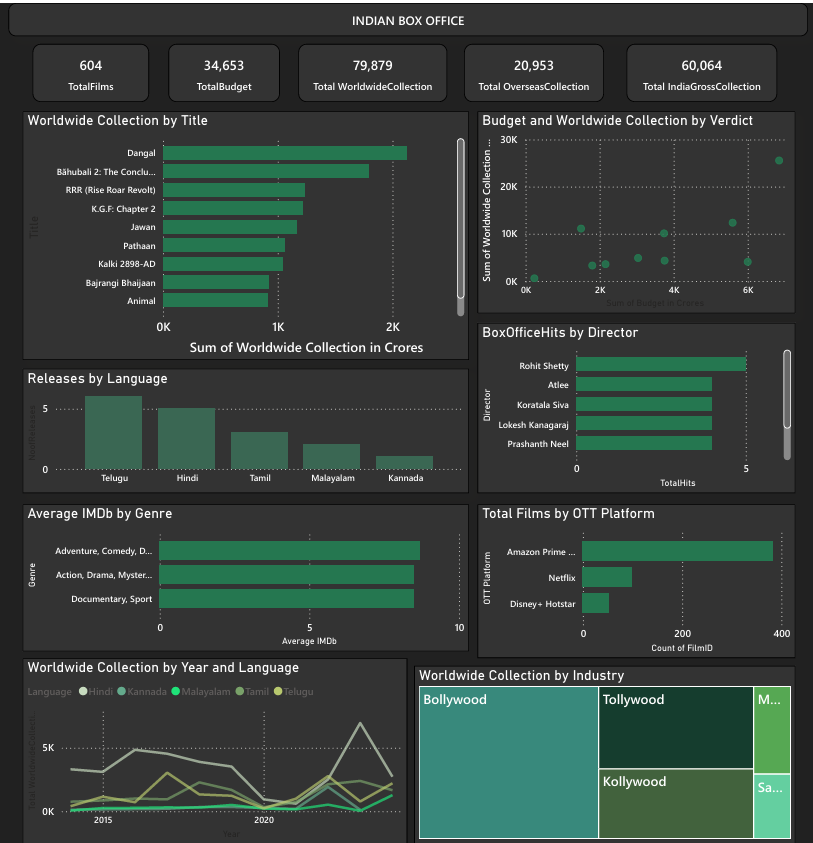
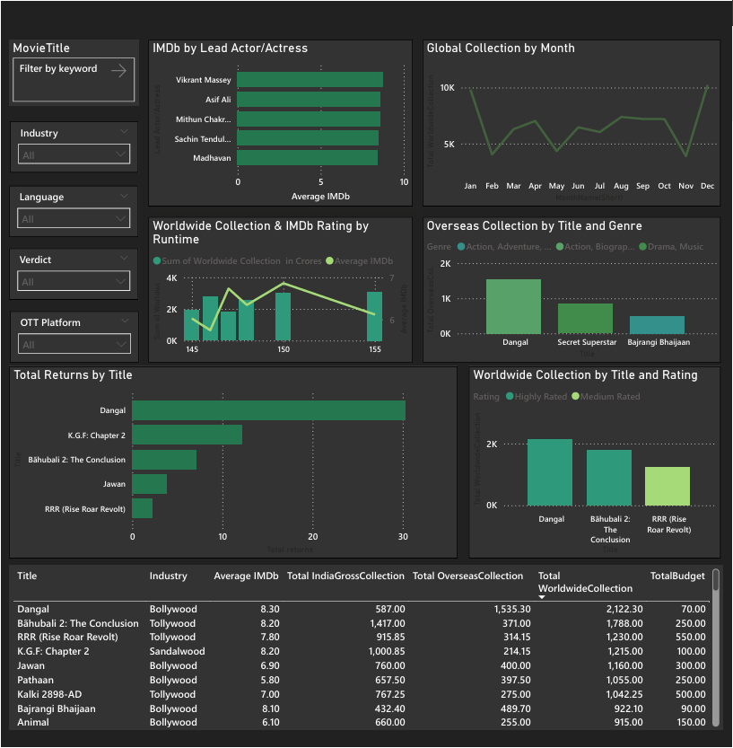

📊 Box Office Analysis Dashboard | Power BI
Excited to share my Power BI Box Office Analysis dashboard, where I transformed raw movie data into meaningful business insights.

✅ Worldwide & Overseas Collection analysis

 ✅ Year-wise & Month-wise revenue trends
 
 ✅ Language-wise and Genre-wise performance
 
 ✅ OTT platform-wise film distribution
 
 ✅ KPIs for revenue tracking
 
 ✅ IMDb rating 
 
Key Learnings from This Project

✔ Data modeling and relationships

 ✔ DAX calculations for KPIs and measures
 
 ✔ Dashboard layout and design
 
 ✔ Visual selection and formatting
 
 ✔ Insight-focused reporting
 
This project strengthened my understanding of data modeling, DAX, and visual storytelling in Power BI.

**Dashboard Preview:**

