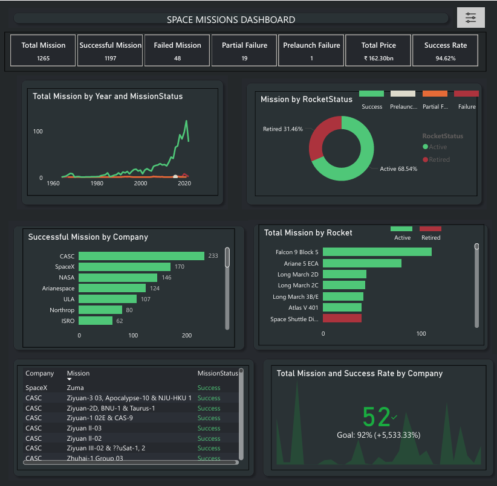

This dashboard provides a comprehensive view of global space missions, focusing on mission outcomes, rocket status, company performance, and long-term mission trends. It is designed to help stakeholders quickly understand overall mission reliability and operational efficiency.

🛠 Tools & Techniques Used

Power BI for data visualization

DAX for calculated metrics

Data modeling and performance optimization

Interactive filtering and Bookmarks

Buttons are implemented

**Dashboard Preview:**

